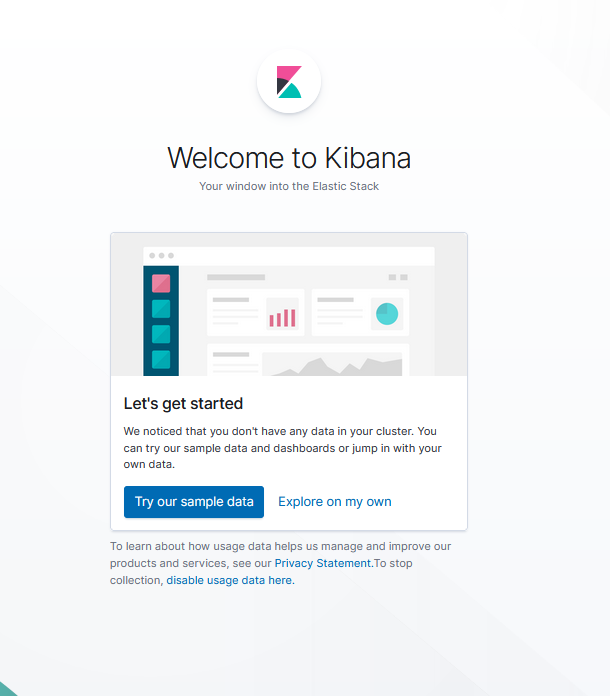

## Automated ELK Stack Deployment

The files in this repository were used to configure the network depicted below.


These files have been tested and used to generate a live ELK deployment on Azure. They can be used to either recreate the entire deployment pictured above. Alternatively, select portions of the Ansible-Playbook file may be used to install only certain pieces of it, such as Filebeat.

  - Kibana Programs:  filebeat-playbook.yml
                      metricbeat-playbook.yml

This document contains the following details:
- Description of the Topology
- Access Policies
- ELK Configuration
  - Beats in Use
  - Machines Being Monitored
- How to Use the Ansible Build


### Description of the Topology

The main purpose of this network is to expose a load-balanced and monitored instance of DVWA, the D* Vulnerable Web Application.

Load balancing ensures that the application will be highly available, in addition to restricting access to the network.
- Load balancers protect the system from DDoS attacks by shifting attack traffic. The advantage of a jumpbox is to give access to the user from a single node that can be secured and monitored. 

Integrating an ELK server allows users to easily monitor the vulnerable VMs for changes to the jumpbox and system.
- Filebeat is a lightweight transport for forwarding and centralizing log data. Installed as an agent on your servers, Filebeat monitors the log files or locations that you specify, collects log events, and forwards them either to Elasticsearch or Logstash for indexing. 
- Metricbeat takes the metrics and statistics that it collects and transports them to the output that you specify, such as  Elasticsearch or Logstash. Metricbeat helps you monitor your servers by collecting metrics from the system and services running on a server.

The configuration details of each machine may be found below.

| Name     | Function                | IP Address      | Operating System |
|----------|-------------------------|-----------------|------------------|
| Jump Box | Gateway                 | 10.0.0.6        |      Linux       |
|ELK Stack | ElasticSearch Stack     | 10.4.0.4        |      Linux       |
| Web-1    | Web Server              | 10.0.0.4        |      Linux       |
| Web-2    | Web Server              | 10.0.0.7        |      Linux       |

### Access Policies

The machines on the internal network are not exposed to the public Internet. 

Only the Jump Box machine can accept connections from the Internet. Access to this machine is only allowed from the following IP addresses:

- 104.42.15.91 

Machines within the network can only be accessed by private IP addresses.
- The only machine that is allowed to connect to the Elk VM is through the Jump Box. The IP address to connect from the Jump box to the ELK VM is through 10.4.0.4, which is a private IP address.

A summary of the access policies in place can be found in the table below.

| Name     | Publicly Accessible | Allowed IP Addresses |
|----------|---------------------|----------------------|
| Jump Box |SSH-22-Yes with my IP| 104.42.15.91         |
| Elk-Stack|       No            | 52.255.201.85        |
| Web-1    |       No            | Web LB 13.91.218.12  |
| Web-2    |       No            | Web LB 13.91.218.12  |
| Web LB   | HTTP - 80 - Yes     |       *              |
| ELK      |Kibana-5601-Yes-with my IP|       *              |
| ELK      | HTTP API-9200-Yes-with my IP   |  10.0.0.0/16         |
### Elk Configuration

Ansible was used to automate configuration of the ELK machine. No configuration was performed manually, which is advantageous because...
- The main advantage using Ansible as an automatic system it allows programs to run on a continous basis without interruption or interaction from employees. It saves time and money by not having to continually writing scripts.

The playbook implements the following tasks:
--- To setup an ELK VM on an Ansible container, please expand script below. To write a play to configure the ELK server, should only run on the VM in the [elk] group. Then use the hosts file as an option in Ansible to specify which machines to run a set of tasks against.
```
- name: Configure Elk VM with Docker
  hosts: elk
  remote_user: azadmin
  become: true
  tasks:
    # Use apt module
    - name: Install docker.io
      apt:
        update_cache: yes
        force_apt_get: yes
        name: docker.io
        state: present

      # Use apt module
    - name: Install python3-pip
      apt:
        force_apt_get: yes
        name: python3-pip
        state: present

      # Use pip module (It will default to pip3)
    - name: Install Docker module
      pip:
        name:  docker
        state: present

      # Use command module
    - name: Increase virtual memory
      command: sysctl -w vm.max_map_count=262144

      # Use sysctl module
    - name: Use more memory
      sysctl:
        name: vm.max_map_count
        value: "262144"
        state: present
        reload: yes

      # Use docker_container module
    - name: download and launch a docker elk container
      docker_container:
        name: elk
        image: sebp/elk:761
        state: started
        restart_policy: always
        # Please list the ports that ELK runs on
        published_ports:
          -  5601:5601
          -  9200:9200
          -  5044:5044

      # Use systemd module
    - name: Enable service docker on boot
      systemd:
        name: docker
        enabled: yes
```


The following screenshot displays the result of running `docker ps` after successfully configuring the ELK instance.


### Target Machines & Beats
This ELK server is configured to monitor the following machines:
- Web-1               10.0.0.4
- Web-2               10.0.0.7
- JackBox Provisioner 10.0.0.6
- Kibana              10.4.0.4

We have installed the following Beats on these machines:
- Filebeat
- Metricbeat
- ELK

These Beats allow us to collect the following information from each machine:
- Filebeat collects data on filtered protocols that are set by the user. An example of such data collection can be exemplified by being able to manipulate the time duration of collecting the data, what type of data can be captured, such as 404 and 505 errors, and being able to filter out data derived from specific geographical locations. Also filebeat captures such events as logins to see who is actively logging into the system. An example of a Filebeat is as follows 
-Filebeat example:
- Jul 24, 2021 @ 21:22:59.000Web-2
- 
- Metricbeat is a lightweight shippper that you can install on your servers to periodically collect metrics/data from the operating system and from services running on the server. Metricbeat take the metrics and statistics that is collects. An example of the data collected during a specific day is as follows:
-Metricbeat example:
- 

### Using the Playbook
- In order to use the playbook, you will need to have an Ansible control node already configured. Assuming you have such a control node provisioned: 

SSH into the control node and follow the steps below:
- Copy the elk_install.yml file to /etc/Ansible/roles/elk_install.yml.
- Update the hosts file to include attribute, such as [elk], then include your destination IP of the ELK server to directly below.

- Example of host file 
 This is the default ansible 'hosts' file.
 It should live in /etc/Ansible/hosts

   - Comments begin with the '#' character
   - Blank lines are ignored
   - Groups of hosts are delimited by [header] elements
   - You can enter hostnames or ip addresses
   - A hostname/ip can be a member of multiple groups

[webservers]
10.0.0.4 ansible_python_interpreter=/usr/bin/python3
10.0.0.7 ansible_python_interpreter=/usr/bin/python3

[elk]
10.4.0.4 ansible_python_interpreter=/usr/bin/python3
 
*_From desktop to the Kibana website, the following process was implemented to set up the ELK website. 
- Run the playbook, and navigate to http://<[your_elk_server_ip]>:5601/app/kibana to check that the installation worked as expected. An example of the start screen is as follows:
-  

- The ansible-playbook compiles the filebeat-playbook and other  
  -playbook programs. The following is the ansible-playbook program compiling the filebeat-playbook program.
- 
- To ascertain if the filebeat program was compiled correctly in Kibana, you look for the following designation:
-  
- The filebeat-playbook is copied to /etc/ansible/roles/filebeat-playbook.yml folder. Typically .yml files are used to run the playbook and are stored in containers where ansible-playbook is used to deploy the playbook files.
- The  hosts file usually allows for the grouping of virtual machines and has the settings where you can dictate the deployment of the playbook files.
_Bonus - How to start from your desktop to getting to your records online with Kibana_
To get into Jump Box
- ssh azadmin@<Jump-box-ProvisionerPublicIPAddress>
- 
To get into and start ELK Server - Logs are located
- Sudo Docker container list -a
- 
- Sudo docker start [container name]
-  
- sudo docker attach [container name]
- 
- sudo docker ps
- 
- ansible-playbook [.yml file to run]
- 
To get into Kibana Online - Open a Browser
-  <ELKIPAddress>/app/kibana/
- 